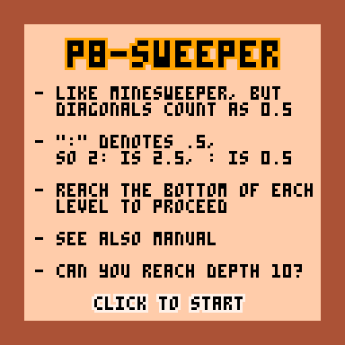
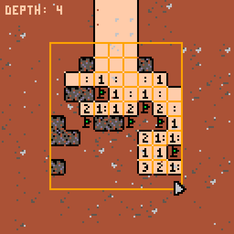
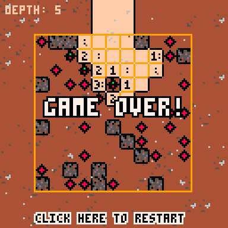
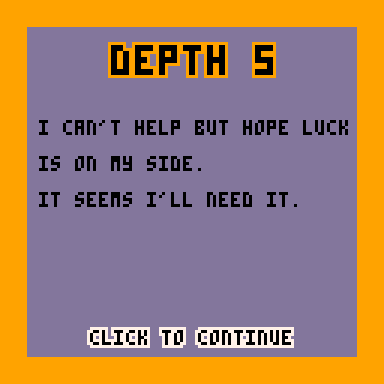

# P8-Sweeper (entry for Ludum Dare 57)

A [PICO-8](https://www.lexaloffle.com/pico-8.php) cartridge with a Minesweeper inspired game.

👉 [Play the game online](https://zommerfelds.github.io/ldjam57-p8sweeper/) 👈

Screenshots:






GIF:


## Manual

* A number on the grid means how many mines are around that field. Diagonal mines count as half.

* Notation: a `:` symbol is used in the game to mean "and a half" (+0.5)

| In game | Value |
| -------- | ------- |
|  (no symbol) | 0 |
| `:` | 0.50 |
| `1` | 1 |
| `1:` | 1.5 |
| `2` | 2 |
| `2:` | 2.5 |
| `3` | 3 |
| `3:` | 3.5 |
| `4` | 4 |
| `4:` | 4.5 |
| `5` | 5 |

* Solving examples:

Here you can see that all of the marked fields must be empty because they touch fields with a "zero". The rightmost arrow is also empty because the `:` can only have diagonal mines close to it (otherwise it would be 1 or more).


Now in the next step you can see that the only field left for the `:` must be a mine.


Here you see that the corner `1` already has a diagonal mine, so it can't have any horizontally or vertically adjacent mines, otherwise it would be 1.5. The arrow to the right is showing how the only way to solve the `1:` is to place a mine there.


## Dev notes

### Tasks

- [x] Draw base grid with numbers
- [x] Mouse click
- [x] Hide invisible numbers
- [x] Click to uncover
- [x] Flag mines
- [x] Win and lose condition
- [x] Make puzzle generation better (solvable)
- [x] Better graphics like mockup (e.g. don't draw grid in uncovered land)
- [x] Tutorial
- [x] Levels (depth indicator) and make into actual game
- [x] Sound
- [x] Exploration animation
- [x] Better tiles
- [x] Story
- [ ] Manual in README
- [ ] Music

### Commands

To deploy a new version: `bash deploy.sh`

Export zip: first run vscode task, then:

```
"C:\Program Files\7-Zip\7z.exe" a -tzip export/web.zip ./export/index.html ./export/index.js
```

To see debug logs, type "folder" in PICO-8 and open the mylog.txt file.
